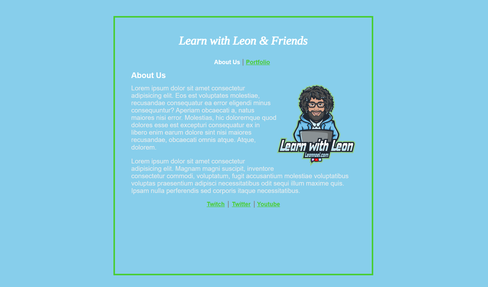
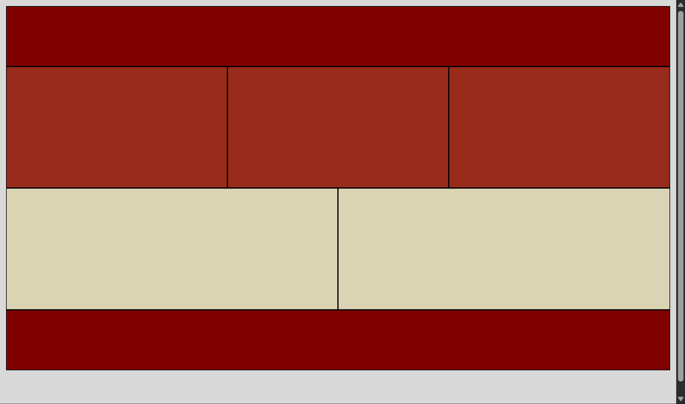
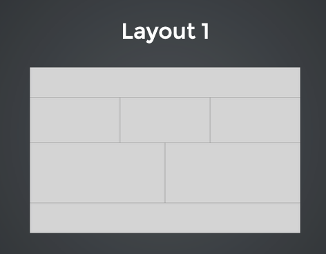
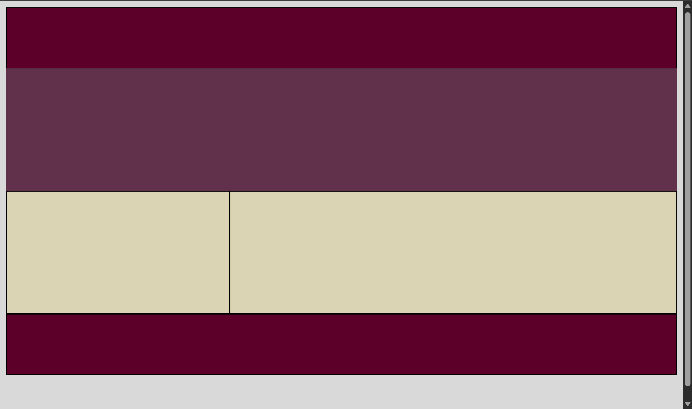
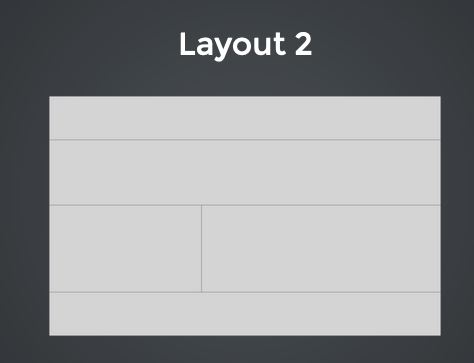
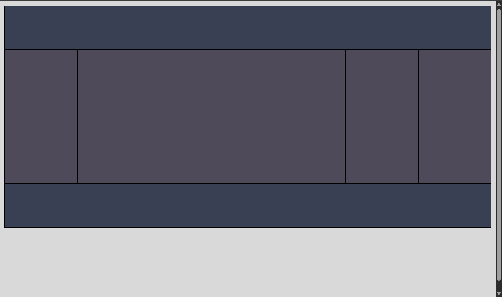

# Class 4 & 5 HW: 
## Task List:
##### link: 
***Homework prefixed with an asterisk are mandatory. The rest are optional***
1. [x]*Finish [Simple Site](https://communitytaught.org/img/resources/simple-site-lab.png) Lab, HTML and CSS
2. [x]*Complete the Three Layouts from class 5, HTML and CSS. [Layout 1](https://communitytaught.org/img/resources/layout1.png), [Layout 2](https://communitytaught.org/img/resources/layout2.png), [Layout 3](https://communitytaught.org/img/resources/layout3.png) 
3. [x]Read [Shay Howe: Responsive Design](https://learn.shayhowe.com/advanced-html-css/responsive-web-design/)
4. [x]Practice Typing
5. [x]Do five minute typing test    
---
### Due Class 6:

### Previews:

#### Simple Site Lab:

[Simple Site Lab codepen](https://codepen.io/IROMEO/pen/dPoLwgd)

#### Layout 1:

[Layout 1 codepen](https://codepen.io/IROMEO/pen/azOxPxy)

#### Layout 2:

[Layout 2 codepen](https://codepen.io/IROMEO/full/ogXOJRq)

#### Layout 3:

[Layout 3 codepen](https://codepen.io/IROMEO/full/myJgaZQ)

