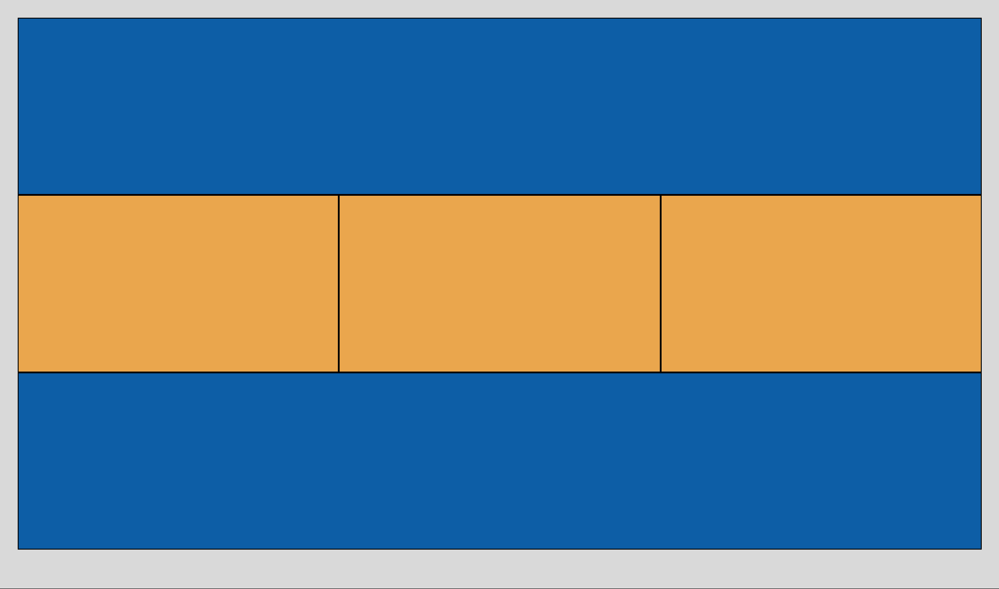
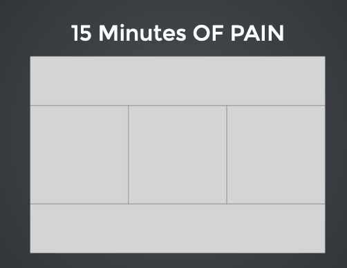
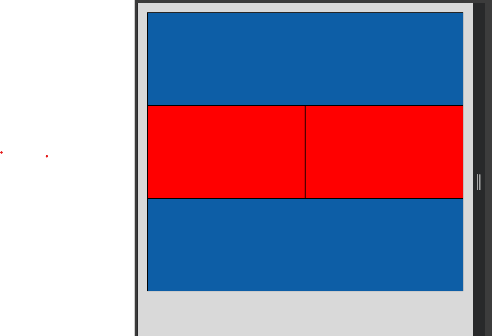
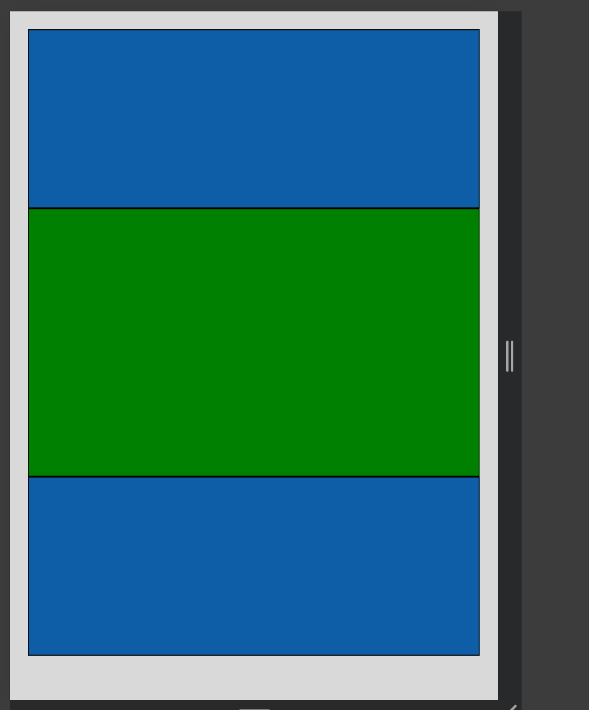

# Class 6: 
## Task List:
##### link: 
***Homework prefixed with an asterisk are mandatory. The rest are optional***
1. [x][*Make 15 minutes of pain responsive (use floats and 3 media queries)](https://communitytaught.org/img/resources/15-min-pain.png)
2. [x][Read Shay Howe: Advanced (all 10)](https://learn.shayhowe.com/advanced-html-css/)    

---
### Due Class 8:

### Completed HW due Class 8!
#### [Submit Link](https://docs.google.com/forms/d/e/1FAIpQLSckLQFQv7B0ToQ9S-fHIJUSA7KdfzpF62_kaJIcl1sfSb74vQ/viewform)
#### Submitted 🟩👍04.07.2025

### Previews:

#### 15 Minutes of Pain

[codepen](https://codepen.io/IROMEO/pen/NPqmoVp)

#### Responsive 

### Shay Howe Advanced Notes: 

1) [Lesson 1: Performance & Organization](https://learn.shayhowe.com/advanced-html-css/performance-organization/) 🟩 02.07.2025
2) [Lesson 2: Detailed Positioning](https://learn.shayhowe.com/advanced-html-css/detailed-css-positioning/) 🟩 02.07.2025
3) [Lesson 3: Complex Selectors](https://learn.shayhowe.com/advanced-html-css/complex-selectors/) 🟩 03.07.2025
4) [Lesson 4: Responsive Web Design](https://learn.shayhowe.com/advanced-html-css/responsive-web-design/) 🟩 03.07.2025
5) [Lesson 5: Preprocessors](https://learn.shayhowe.com/advanced-html-css/preprocessors/) 🟩 03.07.2025
6) [Lesson 6: jQuery](https://learn.shayhowe.com/advanced-html-css/jquery/) 🟧~ 04.07.2025
7) [Lesson 7: Transforms](https://learn.shayhowe.com/advanced-html-css/css-transforms/) 🟧~ 04.07.2025
8) [Lesson 8: Transitions & Animations](https://learn.shayhowe.com/advanced-html-css/transitions-animations/) 🟧~ 04.07.2025
9) [Lesson 9: Feature Support & Polyfills](https://learn.shayhowe.com/advanced-html-css/feature-support-polyfills/) 🟧~ 04.07.2025
10) [Lesson 10: Extending Semantics & Accessibility](https://learn.shayhowe.com/advanced-html-css/semantics-accessibility/) 🟧~ 04.07.2025
