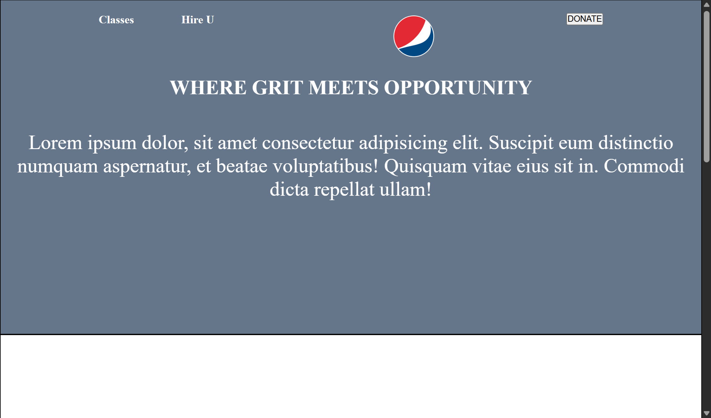

# Class 8: 
## Task List:
##### link: 
***Homework prefixed with an asterisk are mandatory. The rest are optional***
1. [x]*Complete the 3 layouts we did in class (with CSS this time). [BBC](./images/bbc-image.png), [Khan Academy](./images/khan-academy.png), and [Tech Crunch](./images/techcrunch.png) - Class 8
    - [BBC Layout](./images/BBCLayoutAttempt.png) 🟩👍V1 04.07.2025
    - [Khan Academy](./images/KhanAcademyAttempt.png) 🟩👍V1 05.07.2025
    - [Tech Crunch](./images/TechCrunchLayoutAttempt.png)  🟩👍V1 05.07.2025
2. [x]*Do the [Level Ground](./images/level-ground.png) & [Source](./images/source.png) layouts - Class 8
    - [Level Ground](./images/LevelGroundLayoutAttempt.png) 🟩👍V1 05.07.2025
    - [Source]()
3. [x]*Do the Restaurant & Hair Salon layouts - Class 10
    - [Restaurant]()
    - [Hair Salon]()
4. [x]Watch Javascript crash course for beginners - Class 10

### Extras: 
5. Complete Pushwork layout (Can optionally submit this) - Class 8
    - [Pushwork]()
6. Add media queries to other layouts - Class 8
7. FCC Flexbox Tutorial - Class 10
8. Flexbox in 20 minutes - Class 10
9. Flexbox Zombies - Class 10
---
### Completed HW due Class 8!
#### [Submit Link](https://docs.google.com/forms/d/e/1FAIpQLSckLQFQv7B0ToQ9S-fHIJUSA7KdfzpF62_kaJIcl1sfSb74vQ/viewform)
#### Submitted 🟩👍04.07.2025
---
### Due Class 12:

#### [Submit Link](https://docs.google.com/forms/d/e/1FAIpQLSdSxi0K6RNApPyDp3CUP0CVjcM8v89bw_wG9gCyFZiZfEvaJw/viewform?pli=1)
#### Submitted 
---

### Class 8 Tasks:

#### BBC layout:

[codepen](https://codepen.io/IROMEO/full/GgJbbXo)

---

---
#### Khan Academy Layout: 

[codepen](https://codepen.io/IROMEO/full/qEdeWEr)

---

---

#### Tech Crunch Layout: 

[codepen](https://codepen.io/IROMEO/full/GgJVKyw)

---

---

#### Level Ground Layout: 

[codepen](https://codepen.io/IROMEO/full/LEVwYBv)

---

---

#### Source Layout: 

[codepen]()

---

---